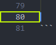
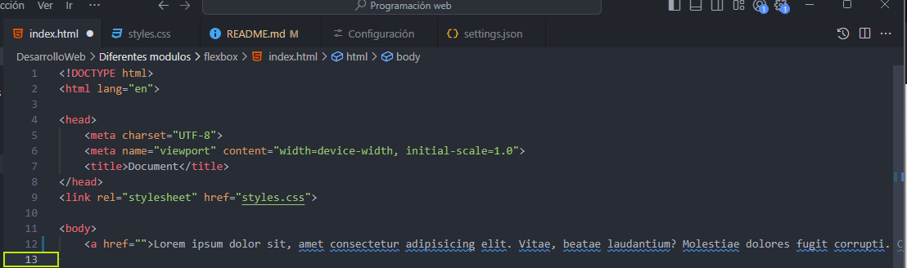
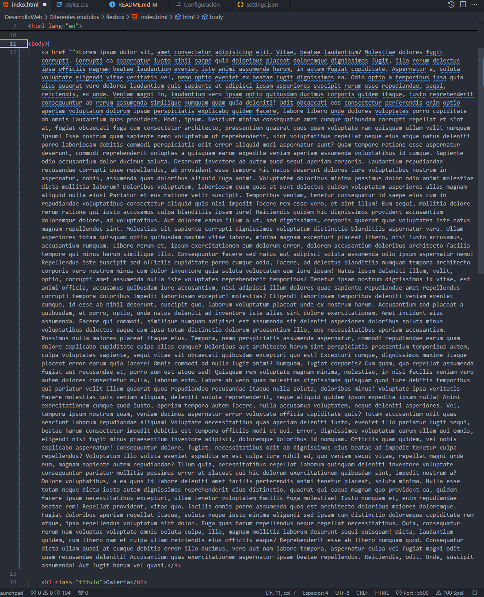

# VsCodeConfigs
Configuraciones del Visual Studio 


Este repositorio es para almacenar y mostrar mis configuraciones de **Visual Studio code** 


# Atom One Dark
```
"workbench.colorTheme": "Atom One Dark"
```
# IndentRainbow


La extensión de Indent rainbow te permite guiarte de manera visual en que nivel estan las llaves o el indentado, es util cuando trabajas con programas como Python que no utilizan ningun tipo de llaves para cerrar funciones, clases, metodos, o condicionales 

## Estilo del indicador
```
 "indentRainbow.indicatorStyle": "light" 
 ``` 

Es para que solo se pinte la linea y no todo el fondo 

## Colores
``` 
    "indentRainbow.colors": [
        "rgba(255,255,64,0.07)",
        "rgba(255,127,255,0.07)",
        "rgba(79,236,236,0.07)"
    ] 
```    
Aqui solo hay que jugar con los valores RGBA    

## Grosor
para indicar el grosor de las lineas 

```
 "indentRainbow.lightIndicatorStyleLineWidth": 2 
 
```

Solo hay que jugar con el valor en este caso 2 


# Temas de Iconos


 ```
 "workbench.iconTheme": "material-icon-theme"
```

# Activity bar 


Con este comando podras configurar el activity bar hacia abajo, logrando asi ganar mas espacio de trabajo 

```
    "workbench.activityBar.location": "bottom",


```

# Linea Brillante seleccionada 



Con el siguiente comando se puede cambiar la forma 

```
 "editor.renderLineHighlight": "gutter"

 ```

Con el siguiente comando se puede cambiar el color  

 ```
    "workbench.colorCustomizations": {
        "editor.lineHighlightBorder": "#bdef09"
    }

```

# WORDWRAP

con el siguiente comando logras que todo tu codigo quepa en tu pantalla no importa el tamaño ni la resolución 

## Desactivada


## Activada

``` 
 "editor.wordWrap": "on"
```
